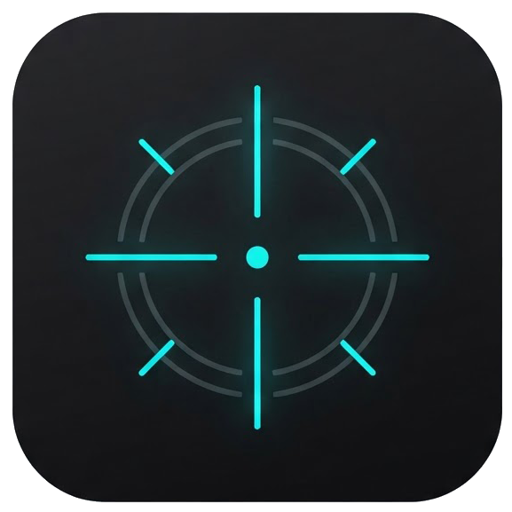
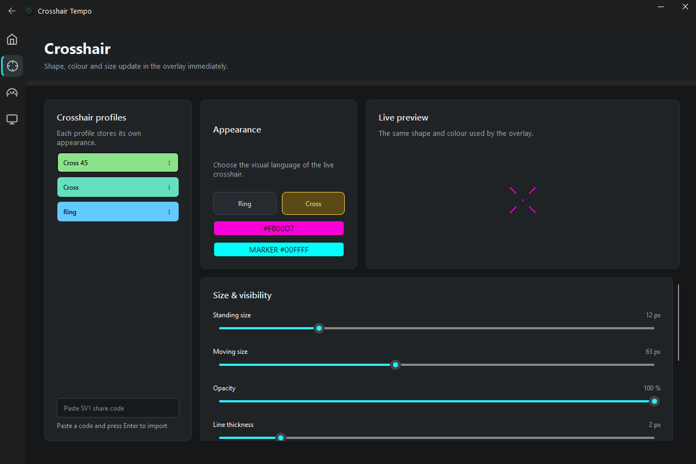

<table>
  <tr>
    <td width="112"></td>
    <td>
      <h1>Crosshair Tempo</h1>
      <strong>A dynamic crosshair that moves with you.</strong> 
      Crosshair Tempo is a customisable CS2 overlay that expands, contracts, and changes state as you move. Create profiles and tune every visual detail to your style.
    </td>
  </tr>
</table>

## Demo

Click the preview to open the full-quality video.

## Crosshair customisation

Create and save named crosshair profiles, then customise their shape, colours, size, opacity, rotation, line thickness, gap, and centre dot. Enable **CS2-only mode** to show the visualisation only while Counter-Strike 2 is focused.

## Status

Crosshair Tempo uses a local, input-based movement estimate to drive its dynamic states. It does not access CS2 telemetry, GSI, game memory, or game files.

## Run

1. Install Python 3.11+ for Windows.
2. Run `py -m pip install -r requirements.txt`.
3. Run `py -m crosshair_tempo`.
4. Run CS2 in **Fullscreen Windowed** mode, then enable the overlay from the app or with the configured hotkey (default `F8`).

The input listener observes movement keys locally while CS2 is focused. It does not send, replay, or block keyboard or mouse input.

## Controls

- **F8** — show/hide the overlay
- **System tray** — open settings, toggle the overlay, or quit

## Settings

Settings are written to `settings.json` in the project root and restored at launch. `CS2-only mode` is on by default and controls both tracking and overlay visibility.

Crosshair appearance is stored as named profiles in `crosshairs/*.json`. The Crosshair tab can create, select, clone, rename, and delete profiles; every profile keeps its own ring/cross shape, colour, sizes, opacity, and a stable accent colour in the profile list.

## Sharing crosshairs

Open a profile's `⋮` menu and choose **Copy share code**. The self-contained `SV1:` code contains only the appearance settings, so it can be pasted into Discord or any chat without a server. On another computer, choose **Import share code**, paste it into the inline field, and press Enter. An import always creates a new profile; older codes remain supported as new settings receive defaults.

## Privacy & scope

Crosshair Tempo is a local visualisation tool. While CS2 is focused, it observes the movement keys you press (A, D, W, S, and Ctrl) and uses that local input only to update the crosshair visualisation. It does not inject into CS2, read game memory, modify game files, use GSI, send telemetry, or generate keyboard or mouse input.

## Attribution

The input-event separation and state-tracking direction are inspired by [CS2Kitchen cStrafe-UI-minimal](https://github.com/cs2kitchen/cStrafe-UI-minimal), licensed under MIT. This project does not copy its Tkinter UI or classification features.
